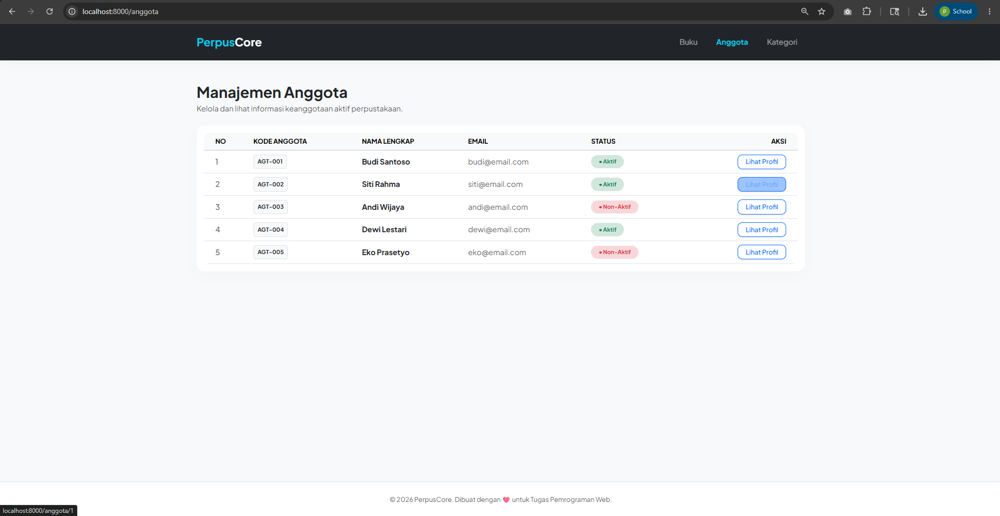
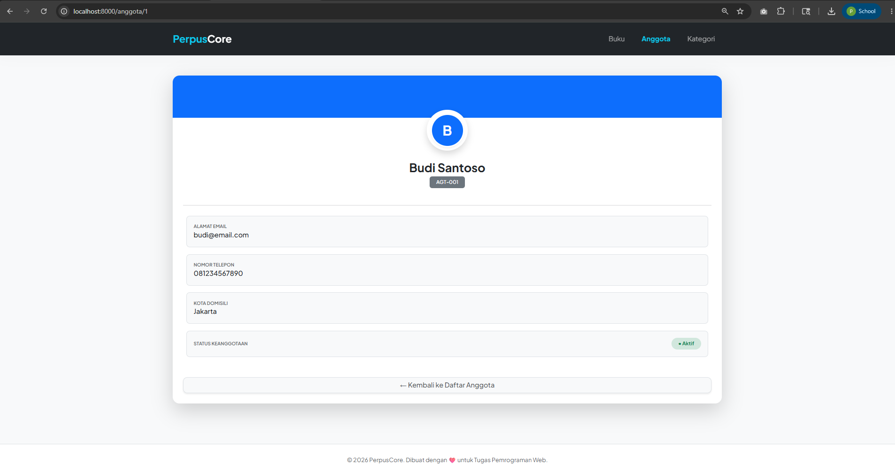
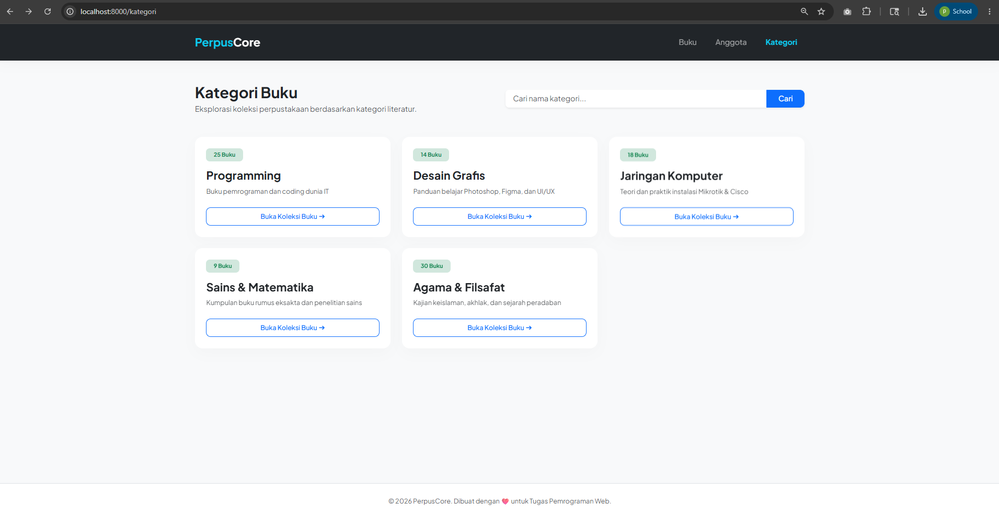
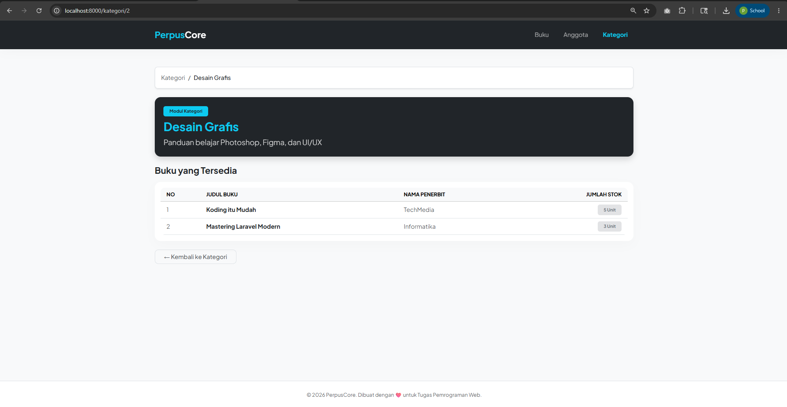
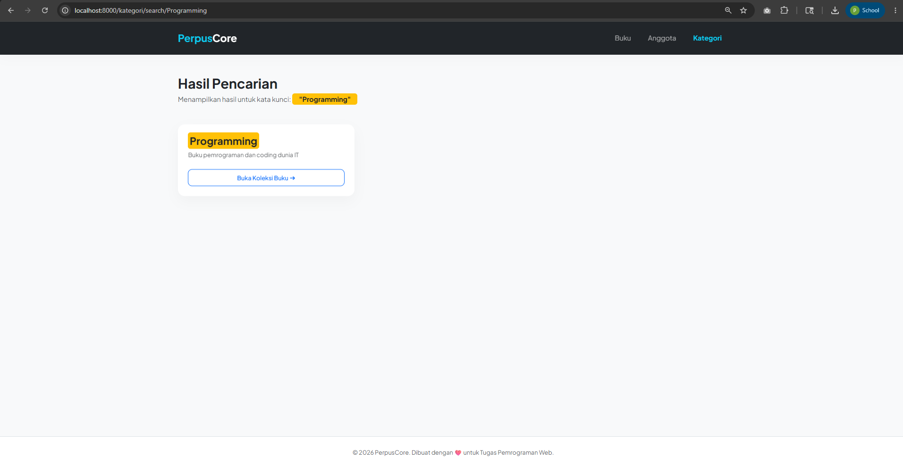

# Tugas Pertemuan 9 - Pengenalan Framework Laravel MVC

**Nama:** Puspa Dwi Setyorini
**NIM:** 60324003  
**Prodi:** Informatika  
**Semester:** 4 (Empat)
**Mata Kuliah:** Pemrograman Web II  
**Repository:** [Link GitHub](https://github.com/Puspa79/Tugas-Pertemuan-9-PENGENALAN-FRAMEWORK-LARAVEL-MVC)

---

## Tugas 1 - Routing dan View Anggota

Tugas ini mengimplementasikan sistem routing statis dan Blade View menggunakan master layout Bootstrap untuk mengelola data anggota perpustakaan.

### Route yang dibuat:
| Method | URL | Named Route | Keterangan |
|--------|-----|-------------|------------|
| GET | `/anggota` | `anggota.index` | Menampilkan seluruh daftar anggota |
| GET | `/anggota/{id}` | `anggota.show` | Menampilkan informasi profil detail anggota |

### Fitur Tampilan:
- Menggunakan Master Layout terpusat (`layouts/app.blade.php`) beserta Navbar navigasi interaktif.
- Badge Bootstrap otomatis (Hijau untuk status **Aktif** dan Merah untuk status **Non-Aktif**).
- Desain *Profile Card* minimalis pada halaman detail.

### Dokumentasi Screenshot:

#### 1. Tampilan Daftar Anggota (`/anggota`)


#### 2. Detail Anggota (`/anggota/1`)


---

## Tugas 2 - Controller Kategori Buku (MVC Lengkap)

Tugas ini mengimplementasikan pemisahan logika menggunakan Controller (`KategoriController`) untuk memproses data kategori literatur perpustakaan dan mengirimkannya ke Blade View.

### Controller yang digunakan: `KategoriController`
- `index()` — Memproses data 5 kategori utama ke bentuk Bootstrap Cards.
- `show($id)` — Menampilkan detail informasi kategori beserta daftar koleksi buku di dalamnya (dilengkapi *breadcrumb*).
- `search($keyword)` — Memfilter data kategori yang dicari dan memberikan efek stabilo (*highlighting*) menggunakan tag `<mark>` pada kata kunci yang cocok.

### Route yang dibuat:
| Method | URL | Controller & Method | Keterangan |
|--------|-----|---------------------|------------|
| GET | `/kategori` | `KategoriController@index` | Daftar kartu kategori buku |
| GET | `/kategori/{id}` | `KategoriController@show` | Detail kategori & list buku |
| GET | `/kategori/search/{keyword}` | `KategoriController@search` | Hasil pencarian kategori |

### Dokumentasi Screenshot:

#### 1. Tampilan Daftar Kategori (`/kategori`)


#### 2. Detail Kategori (`/kategori/1`)


#### 3. Hasil Pencarian (`/kategori/search/programming`)


---
## Cara Menjalankan Proyek di Lokal

1. Clone repository ini ke dalam folder `laragon/www/`.
2. Jalankan perintah instalasi dependency (jika diperlukan):
   ```bash
   composer install