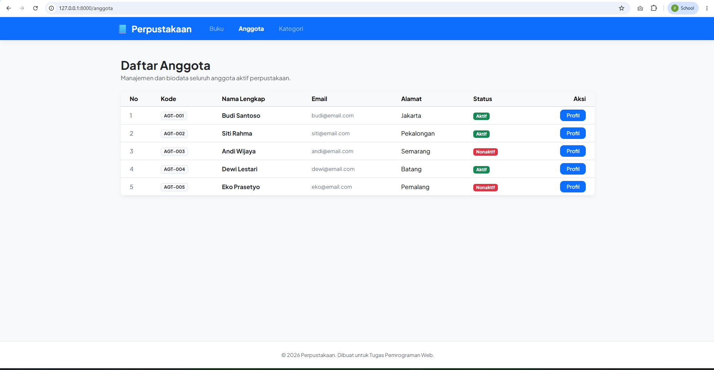
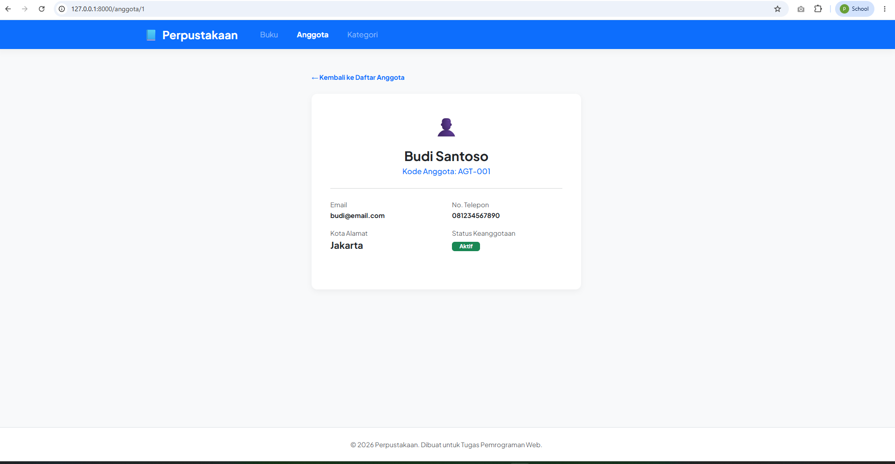
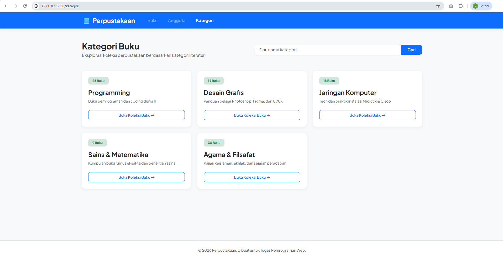
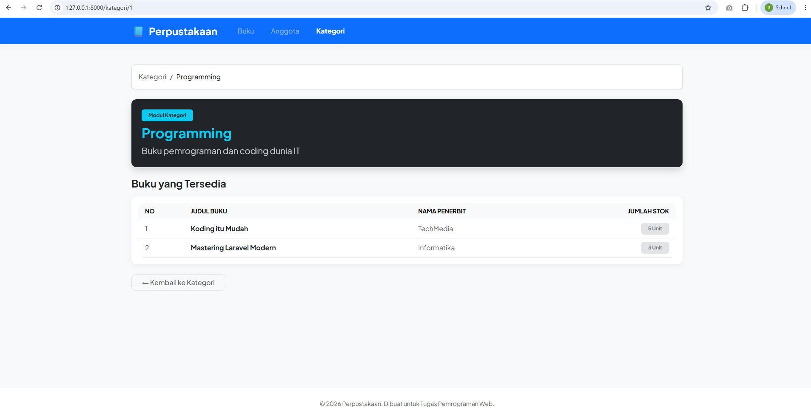
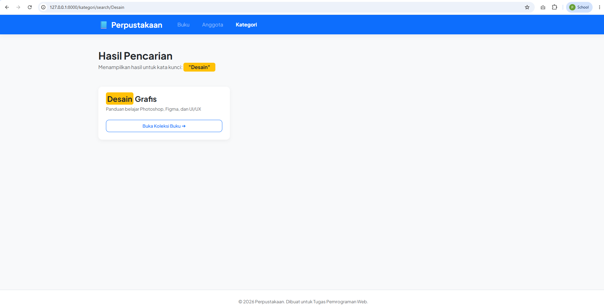

# Tugas Pertemuan 9 - Pengenalan Framework Laravel MVC

**Nama:** Puspa Dwi Setyorini  
**NIM:** 60324003  
**Prodi:** Informatika  
**Semester:** 4  
**Mata Kuliah:** Pemrograman Web II  
**Repository:** [Link GitHub](https://github.com/Puspa79/Tugas-Pertemuan-9-PENGENALAN-FRAMEWORK-LARAVEL-MVC)

## Tugas 1 - Routing dan View Anggota

### Route yang dibuat:
| Method | URL | Named Route | Keterangan |
|--------|-----|-------------|------------|
| GET | `/anggota` | `anggota.index` | Menampilkan seluruh daftar anggota |
| GET | `/anggota/{id}` | `anggota.show` | Menampilkan informasi profil detail anggota |

### Dokumentasi Screenshot:

#### 1. Tampilan Daftar Anggota (`/anggota`)

#### 2. Detail Anggota (`/anggota/1`)

## Tugas 2 - Controller Kategori Buku (MVC Lengkap)

### Route yang dibuat:
| Method | URL | Controller & Method | Keterangan |
|--------|-----|---------------------|------------|
| GET | `/kategori` | `KategoriController@index` | Daftar kartu kategori buku |
| GET | `/kategori/{id}` | `KategoriController@show` | Detail kategori & list buku |
| GET | `/kategori/search/{keyword}` | `KategoriController@search` | Hasil pencarian kategori |

### Dokumentasi Screenshot:

#### 1. Tampilan Daftar Kategori (`/kategori`)

#### 2. Detail Kategori (`/kategori/1`)

#### 3. Hasil Pencarian (`/kategori/search/desain`)
